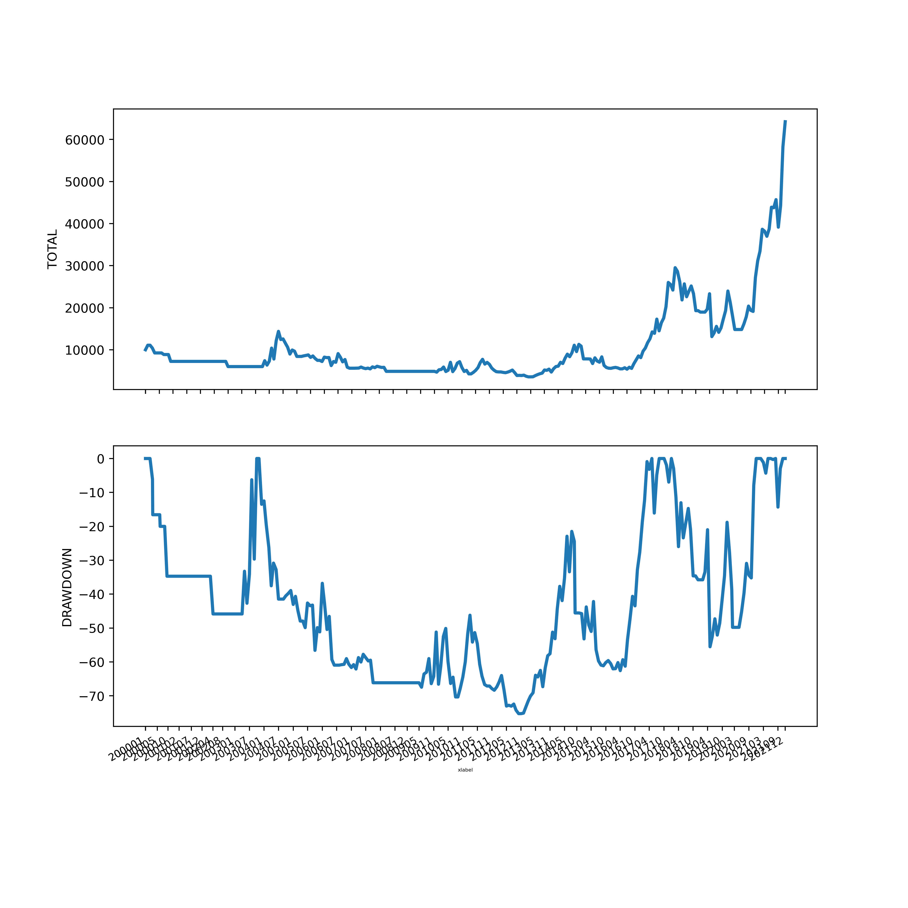

## Backtest - Dynamic Asset Allocation Strategy 동적자산배분

### LAA (Lethargic Asset Allocation)


MM_PERIOD 13.0 
CAGR 9.21 
MDD -16.52658410328465

### UEM QQQ (LAA Variant Only QQQ)


MM_PERIOD 14.5 
CAGR 18.15 
MDD -21.54066954224619

### DUAL MOMENTUM


MM_PERIOD 13.67 
CAGR 11.58 
MDD -15.208144412024996

### UEM SMH (LAA Variant Only SMH)

MM_PERIOD 14.5 
CAGR 18.67 
MDD -26.501303001917485

### memo

```bash
(base) >conda create --name pyconda --clone base
```

## Experimental - Leverage ETF - Risk Hedge



MM_PERIOD 23.33 
CAGR 8.3 
MDD -75.25161282084039

- Risk Control #1 

Pause and hold cash in case of daily returns when fallen more than 20%.


- Risk Control #2 

Balancing a portion of risk asset by AVG Momentum Score


- Risk Control #3

Idea borrowed from LAA, avoid risky by UEM and SP MA200.


- 전략 1

종가 기준 나스닥 -7% 이상 뜨면 공황

공황이면 보유주식 전량 매도 후 2달 기다림

기다리는 동안 다시 -7% 이상 뜨면 그 때 기준으로 

다시 2달 기다림.

```bash
200001 ~ 20210920 (22년) 보유 | 회피
67.17 % | 158.50 %

201001 ~ 20210920 (12년) 보유 | 회피
10909.93 % | 8459.6 %
```

- 전략 2

평단가 

최초 매수 시점: 전고점 기준 MDD 15% 혹은 20% 이하

기준 MDD 10% 추가 매수는 투자원금보다 낮은 금액

평단가를 최초 매수가에 최대한 가깝게 유지

e.g, 라오어 무한매수 1일차 100USD + 2일차 100USD + ....

현금 30 - 50% 보유

MDD 30% 이상 폭락 시, 여유 현금으로 매수

- 전략3

무한매수 전략

https://www.donga.com/news/Economy/article/all/20210619/107534251/1

https://infinite-geometric.tistory.com/47

https://blog.naver.com/hubeq/222501596897

- 전략4

코스닥 종가 3, 5, 10일 이동 평균 3개 다 하회하면 다음날 모든 주식 매도

다시 3개 이동평균선 중 한개라도 상회하면 모든 주식 다시 매수

7% 이상 하락한 종목 손절

- 전략5

종가 기준 5% 하락 시 보유주식 전량 매도 (나스닥 1990년 부터 30년부터 5% 하락은 41일에 불과)

5% 하락 시 전량매도 후 1달 가다림

30일 안에 5% 하락 4번 발생 시 2달을 기다림

기다리는 다시 5% 하락시 각각 1달 2달 기다림.

## Kiwoon securities Open API Overview 퀀트투자

키움증권 Open API 는 파이썬 Python 32비트에서만 작동.

모의투자 거래비밀번호는 0000.

전부 매도 후 시가 매수. 리밸런싱의 경우 20-40 개의 주문을 매번 갱신할 필요가 있으나 이러한 불편함을 개인적으로 해결하기 위한 목적으로 개발.

다만 `data\sell` 과 `data\buy` 안에 있는 csv 파일로 매도 매수 할 종목의 코드번호를 사전에 준비하여야 함.

퀀트킹에서 다운로드 받은 csv를 사용.

주문가능금액을 조회 후 `config.ini` 의 `NUMBER_ITEM` 설정 치를 1/N 한 금액을 종목당 매수금액으로 설정. 

### 키움증권 Open API + Python

TrCode 라는 OpenAPI+의 Request를 전송하는 클라이언트 어플리케이션을 개발하는 컨셉.

Client (개발) <-> Broker (Open API+ Win32제어용) <-> Kiwoom Server

공식적인 API나 일부 예제는 PyQT 또는 Pyside를 사용해 GUI 를 개발 후 이를 통해 키움에서 제공하는 API 와 연계 하는 방식이며 매번 동일한 부분을 다시 쓰므로 불필요한 코드 작성이 많음.

대신 비공식적인 Wrapper API 들은 Request 와 Response Event의 공통된 부분을 API에서 미리 처리함. 비공식적인 Wrapper API 중 kiwoom / koapy / pykiwoom 를 사용해 봤으나 확장성이나 사용성 측면에서 koapy 가 가장 나은 듯함.

Koapy 0.6.1 의 경우 Python 3.10 이상 버전과 호환성이 없음. Python 3.9를 사용함.


 - kiwoom : https://github.com/breadum/kiwoom
 - pykiwoom : https://github.com/sharebook-kr/pykiwoom
 - koapy : https://github.com/elbakramer/koapy

 - https://koapy.readthedocs.io/en/latest/installation.html
 - https://koapy.readthedocs.io/en/latest/_modules/koapy/cli.html
 - https://wikidocs.net/book/1173

### Koapy Core Class

소스코드를 통해 Wrapper의 상세한 구현 내용을 참고할 수 있음.

아래 파일을 참고하면 왠만한 구현은 거의 다 되어 있음.

```bash
KiwoomOpenApiPlusServiceClientStubCoreWrapper.py
```

키움 공식 API 문서에 있는 설명과 사용법은 다소 엉성함. 고로 직접 실행 후 매번 Response를 확인하거나 API 명세를 확인해야 함.

WinAPI 기반 API 를 억지로 다른 언어기반으로 끼워 맞춘듯 해서 Wrapper를 참고 이미 구현된 함수를 사용하는 것이 나음.

### Koapy Command

관련 모듈을 간단히 설치할 수 있는 CMD를 제공. 이미 설치되어 있는 경우 특별히 사용할 필요는 없음.

설치 가이드에는 Anaconda 를 이용한 설정법이 기재되어 있으나 Anaconda 없이도 사용 가능. 

```bash
koapy serve # Koapy Manager/Server 기동

koapy install openapi    # OpenAPI 설치
koapy update openapi     # OpenAPI 자동 버전 업데이트
koapy uninstall openapi  # OpenAPI 삭제

koapy install pywin32    # pywin32 설치
koapy uninstall pywin32  # pywin32 삭제
```
